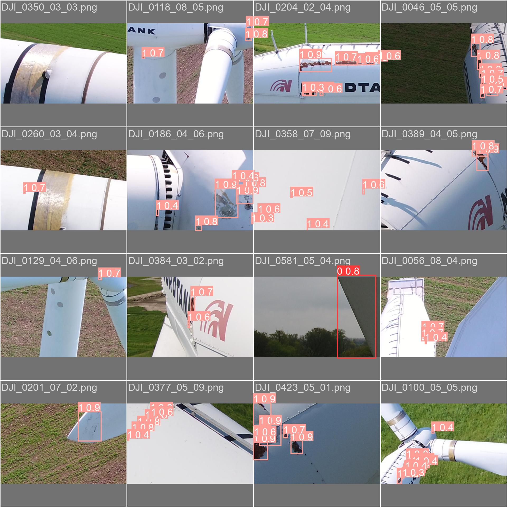

# Diploma_Thesis_2025 - Georgios Giosmas

## "AI ALGORITHMS’ HARDWARE ACCELERATION STUDY ON ARCHITECTURES BASED ON XILINX’ DPU PROCESSING MODULE"

In this diploma thesis we examine a Computer Vision problem. We try to implement an algorithm for wind turbine surface damage detection and then accelerate it on an FPGA. Wind turbine surface damage detection is considered a high risk and high cost procedure as it is time consuming and exposes humans into difficult situations.  Solving the problem with Computer Vision techniques, like Convolutional Neural Networks, has been proven an efficient approach reducing time and achieving high accuracy.

To implement our algorithm we use as reference point the scientific paper [Drone Footage Wind Turbine Surface Damage Detection](https://ieeexplore.ieee.org/document/9816220) and the dataset from [YOLO Annotated Wind Turbine Surface Damage](https://www.kaggle.com/datasets/ajifoster3/yolo-annotated-wind-turbines-586x371). We train the fastest and smallest version of YOLOv5, YOLOv5 Nano, on the wind turbine dataset and then we benchmark the performance of the model on some CPUs, GPUs and a [FPGA ZCU4 from Xilinx's Zynq Ultrascale+ MPSoC family](https://www.xilinx.com/products/boards-and-kits/zcu104.html).

## Training

The training is done with the utilization of [yolov5_repository](https://github.com/ultralytics/yolov5) and the instructions from [ultralytics](https://docs.ultralytics.com/yolov5/) by only using the labeled images of the dataset. After training we receive our algorithm, [yolov5n_windturbines](https://github.com/GeorgiosGiosmas/Diploma_Thesis_2025/blob/main/Inference_on_CPU/best.pt) and get the following results:

The performance of the algorithm on the validation dataset can be seen below:

Performance across different hardware devices:

## Hardware Acceleration FPGA

For inference on ZCU4 is deemed necessary to process our trained model accordingly. The procedure includes the use of [Vitis AI Development Environmment](https://xilinx.github.io/Vitis-AI/3.0/html/index.html), to process the model and acquire a format suitable for deployment on the ZCU4. But before starting processing the model with Vitis AI we perform some pre-processing steps following the instructions from [YOLOv5 Quantization and Compilation with Vitis AI 3.0](https://www.hackster.io/LogicTronix/yolov5-quantization-compilation-with-vitis-ai-3-0-for-kria-7b005d#toc-quantizing-yolov5-pytorch-with-vitis-ai-3-0-5), in order to ensure compatibility with Vitis AI toolchain. Subsequently, we quantize the model using the script [yolov5n_quant.py](yolov5n_quant.py). The quantized model can be evaluated through the [model_inference.py](model_inference.py) script by giving as input the [Quantized Model in Pytorch format](quantize_result/DetectMultiBackend_int.pt). Then, we compile the model with Vitis AI compiler and acquire the [final xmodel format](yolov5n_cd_pt/yolov5n_cd_pt.xmodel) designed for inference on a FPGA.

[Model's Graph](graph.png) contains the CPU and DPU subgraphs in which the Vitis AI Compiler split our model.

Inference on ZCU4 is finally achieved using VART from Vitis AI by running either one of the two scripts [dpu_configuration.py](dpu_configuration.py) and [dpu_configuration_1_DPU.py](dpu_configuration_1_DPU.py). First we configure the FPGA by loading only one DPU(threads=1) and then by loading two DPUs(threads=2). The DPU architecture available for ZCU4 boards is a DPUCZDX8G(B4096) DPU.

Performance on the validation dataset when run on the ZCU4:

Inference on the ZCU4:

## Inference on Raspberry Pi
We also evaluate the performance of our algorithm in Raspberry Pi 3.

Inference on Raspberry Pi 3:

## Experimental Results

Results indicate that acceleration on FPGA provided a decent result as Inference times where 4 times better than the CPU ones. However, we get an increase in Pre-process and NMS times coming from the inability of the embedded arm processor, on the FPGA, to process the Pre-processing stage as effectively as the AMD Ryzen 3600X of our PC. 

